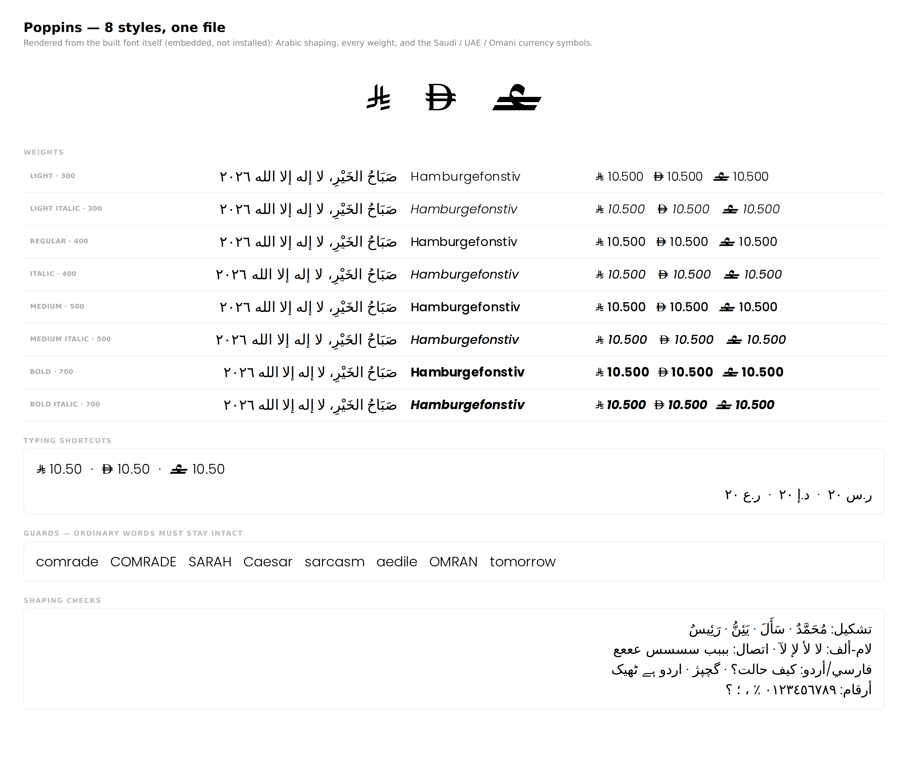

# arabic-font-merge

**[English](README.md)** · العربية

[](https://github.com/Mulhamx4/arabic-font-merge/actions/workflows/smoke-test.yml)
[](LICENSE)

مهارة لـ[كلود](https://docs.claude.com/en/docs/agents-and-tools/agent-skills/overview) تحوّل مجلداً فيه أوزان خط متفرقة إلى **ملف خط واحد قابل للتثبيت**، وتتأكد أن العربية تعمل فعلاً في كل وزن، وتضيف رموز عملات الخليج — الريال السعودي (U+20C1) والدرهم الإماراتي (U+20C3) والريال العماني (U+20C4) — مع اختصارات كتابية مثل `SAR` و`AED` و`OMR` و`ر.س` و`د.إ` و`ر.ع`.

وتعمل أيضاً كأدوات سطر أوامر مستقلة. وجود كلود اختياري.



<sub>النموذج مبني من خط [Poppins](https://github.com/itfoundry/Poppins) برخصة OFL. هذا الخط لا يحتوي عربية أصلاً، لذلك تسقط السطور العربية أعلاه إلى خط النظام — وهي بالضبط الحالة التي يبلّغ عنها `inspect_fonts.py` قبل البناء.</sub>

## لماذا هذه الأداة

عائلات الخطوط التجارية تصل في ٨ إلى ٢٠ ملفاً منفصلاً. تثبيتها مرهق، وتتناثر في قائمة الخطوط، وثلاثة أشياء تتكرر بما يكفي ليستحق أتمتتها:

- **المائل يصل بلا عربية.** كثير من العائلات تضع العربية في الأوزان المنتصبة فقط، فتسقط العربية المكتوبة داخل نص مائل إلى خط النظام دون أي تحذير.
- **قائمة الخطوط فوضى.** كثير من الخطوط تحمل `nameID 2` معطوباً في سجلات ويندوز — حرفياً كلمة "Regular" على كل وجه، حتى Bold Italic — فتقسم البرامج العائلة الواحدة إلى ست عائلات.
- **رمز العملة الجديد ليس له مصدر.** النقاط U+20C1 و20C3 و20C4 إضافات حديثة في يونيكود، ولا يكاد يوجد خط منشور يحتويها. ورسمها يدوياً ليس خياراً: هذه رموز سيادية، والتقريب فيها خطأ.

## ماذا تفعل

| | |
| --- | --- |
| **ملف واحد** | تكتب حزمة OpenType Collection — كل الأوزان داخل ملف `.otc` واحد (ماك) أو `.ttc` (ويندوز)، بلا مساس بالمسارات، وتُثبَّت بنقرة مزدوجة واحدة |
| **العربية في المائل** | تنسخ عربية الوزن المنتصب المقابل إلى أي وجه مائل يفتقدها، منتصبةً كما يقتضي العرف العربي |
| **مدخل واحد في القائمة** | تعيد بناء `nameID 16/17` مع أزواج `1/2` القديمة الصحيحة، فتنطوي العائلة إلى اسم واحد مع قائمة أوزان |
| **رموز العملات** | تضيف الرسم الرسمي من ساما ومصرف الإمارات المركزي والبنك المركزي العماني في نقاطها الصحيحة، مقيسة على ارتفاع الحرف الكبير في كل وزن |
| **اختصارات الكتابة** | `SAR` تتحول إلى ⃁ عبر `calt` السياقي، مع قواعد مانعة تُبقي كلمات مثل `COMRADE` و`SARAH` و`Caesar` و`sarcasm` و`aedile` سليمة |
| **تحقق حقيقي** | تشكّل نصاً عربياً عبر HarfBuzz، وتُطلق كل اختصار، وتتأكد أن ١٥ كلمة قريبة الشبه **لا** تُستبدل، وتقارن عرض التقدّم في CFF مع `hmtx` لكل محرف |
| **دليل يمكن إرساله** | صورة `proof.png` وصفحة `selftest.html` مكتفية بذاتها والخط مضمّن فيها بترميز base64 |

كما تخبرك بصراحة متى يكون **الخط المتغير** مستحيلاً — وهو مستحيل غالباً مع الأوزان الثابتة التجارية. راجع [مسألة الخط المتغير](#مسألة-الخط-المتغير).

## التثبيت

### كمهارة لكلود

```bash
git clone https://github.com/Mulhamx4/arabic-font-merge.git ~/.claude/skills/arabic-font-merge
pip install fonttools brotli uharfbuzz
```

هذا كل شيء. يلتقط كلود المهارة تلقائياً ويشغّلها عندما تسلّمه ملفات خط وتطلب دمجها، أو تذكر أن العربية لا تعمل، أو تطلب إضافة رمز عملة. وفي Claude Code يمكن استدعاؤها مباشرة بـ `/arabic-font-merge`.

لاستخدامها في [Cowork](https://claude.ai) أو تطبيقات كلود، اضغط محتويات المستودع وارفعها كمهارة:

```bash
cd arabic-font-merge && zip -r ../arabic-font-merge.skill . -x '.git/*' 'examples/*'
```

### في المتصفح — بلا تثبيت أصلًا

مجلد `web/` هو المحرّك نفسه يعمل داخل تبويب متصفح عبر
[Pyodide](https://pyodide.org/). لا خادم ولا رفع ولا حساب: الخط يُعالَج على جهاز
الزائر نفسه، والصفحة ممنوعة تقنيًا من إرساله إلى أي مكان.

```bash
python3 -m http.server 8412     # من جذر المستودع
# ثم افتح http://localhost:8412/web/
```

تُقدَّم من جذر المستودع لأن الصفحة تقرأ `scripts/` و`assets/` مباشرة — فالمتصفح
وسطر الأوامر يشغّلان الشيفرة نفسها، وإصلاح في `fontkit.py` يصل إليهما معًا.

للاستضافة: انشر المستودع ووجّه الناس إلى `/web/`، وانسخ
[`web/deploy/headers`](web/deploy/headers) باسم `_headers` في جذر الموقع لتُقدَّم
ترويسة CSP التي لا يستطيع وسم `<meta>` حملها.

والصفحة تبني لك حزمة المهارة داخل متصفحك من الملفات المرفوعة هنا — فما تنزّله هو
ما في المستودع دائمًا.

**ما يضيفه المتصفح على سطر الأوامر**

- **المسار يقرّره الملف لا المستخدم.** الخط المتغيّر يأخذ مسار «رموز فقط» مع
  تحييد تباين العرض في `HVAR`، والخط الذي فيه بت `fsType` الحاجب يُرفض تمامًا.
- **تحقق تفاضلي.** الناتج يُقارَن بمصدرك، فما كان ناقصًا أصلًا لا يُحسب كسرًا
  أحدثناه.
- **عملة من عندك.** لعملة لم تعتمد يونيكود رمزًا لها، ارفع الرسم الرسمي واختر
  نقطة ترميز — الافتراضي منطقة الاستخدام الخاص، وتُرفض النقطة إن كانت ستستبدل
  محرفًا موجودًا. انظر [NOTICE.md](NOTICE.md#currency-artwork-you-supply-yourself).

**وما يظل سطر الأوامر أفضل فيه:** بلا سقف حجم، وتحقق حقيقي بـ HarfBuzz،
و`proof.png`، والأتمتة داخل سكربت.

### كأداة سطر أوامر

```bash
git clone https://github.com/Mulhamx4/arabic-font-merge.git
cd arabic-font-merge
pip install -r requirements.txt
```

بايثون ٣٫٩ فأحدث. يستخدم `make_proof.py` إضافةً إلى ذلك [Playwright](https://playwright.dev/python/) لتوليد الصورة، وبدونه يكتفي بكتابة صفحة HTML.

## الاستخدام

أربعة أوامر بالترتيب. لا تتخطَّ الخطوة الأولى، ولا تتوقف عند الثانية.

```bash
# ١. المسح — يحدد كل ما بعده
python scripts/inspect_fonts.py ~/Fonts/MyFamily

# ٢. البناء — الحزمة + الملفات المفردة + رموز العملات
python scripts/build_family.py ~/Fonts/MyFamily --out build/ --version 2.000 --format ttc

# ٣. التحقق — يخرج بقيمة غير صفرية عند أي فشل
python scripts/verify_font.py "build/MyFamily.ttc"

# ٤. الدليل — صورة وصفحة اختبار ذاتي
python scripts/make_proof.py "build/MyFamily.ttc" --out build/
```

الخطوة ٢ تخبرك بما **نوى** فعله. الخطوة ٣ تفحص ما وصل فعلاً إلى الملف الثنائي. الفرق بينهما هو المكان الذي تعيش فيه الأخطاء.

المخرجات:

```
build/
├── MyFamily.ttc        الملف الواحد
├── otf/                الأوجه نفسها كملفات مفردة
├── web/                woff2 + fonts.css   (مع ‎--woff2‎)
├── proof.png
└── selftest.html
```

### أي صيغة تحتاج؟

**اسأل قبل البناء.** الصيغة ليست تفصيلاً يُؤجَّل إلى النهاية.

| أين سيُستخدم | البناء | لماذا |
| --- | --- | --- |
| ويندوز، أو "في كل مكان" | `--format ttc` | **‏`.otc` لا تُثبَّت على ويندوز إطلاقاً** — لا يعرض المستكشف خيار Install لهذا الامتداد. الملف سليم، لكن ويندوز ببساطة لا يفتحه |
| ماك أو أدوبي فقط | `.otc` الافتراضية | المسارات تبقى مطابقة بايت ببايت |
| فيجما، أو أي برنامج يتصرف بغرابة | مجلد `otf/` | دعم الحزم فيه غير موثّق |
| المواقع | `--woff2` | المتصفحات لا تستطيع تحميل الحزم أصلاً |

يحوّل `--format ttc` المسارات من CFF (تكعيبية) إلى TrueType (تربيعية). القياس على عائلة فيها ٢١٧٠ محرفاً: أكبر إزاحة في المربع المحيط **٠٫٠٥ وحدة على em من ١٠٠٠ وحدة**، وصفر تغيّر في عروض التقدّم. الذي تخسره هو تلميح CFF، وأثره محصور في الأحجام الصغيرة جداً.

### خيارات تستحق المعرفة

| الخيار | متى |
| --- | --- |
| `--version 2.100` | **ارفعه في كل إعادة بناء** — ذواكر الخطوط مفهرسة باسم PostScript وستقدّم لك بيانات قديمة إلى الأبد بدون ذلك |
| `--format ttc` | ويندوز ضمن الهدف |
| `--woff2` | تحتاجه على موقع أيضاً |
| `--family "Name"` | اسم العائلة المستنتج تلقائياً خاطئ |
| `--only omani-rial` | بناء بعض العملات فقط (المعرّفات من `assets/currencies.json`) |
| `--no-symbols` | بلا رموز عملات إطلاقاً |
| `--no-arabic-graft` | إبقاء المائل كما شحنته المسبكة تماماً |
| `--side-bearing 24` | الرمز يبدو واسع الجوانب |
| `--slant-symbols-in-italics` | إمالة الرموز في الأوجه المائلة (معطّل افتراضياً — فهي رموز رسمية) |
| `--single-family` | اسم عائلة قديم واحد لكل الأوجه. اقرأ التحذير في [SKILL.md](SKILL.md) أولاً: برامج حقبة GDI تخاطب أربعة أنماط فقط لكل عائلة، فتخسر عائلة من ١٦ وزناً اثني عشر منها |

## رموز العملات

| العملة | النقطة | يونيكود | مصدر الرسم |
| --- | --- | --- | --- |
| الريال السعودي ⃁ | U+20C1 | 17.0 | البنك المركزي السعودي (ساما) |
| الدرهم الإماراتي ⃃ | U+20C3 | 18.0 | مصرف الإمارات المركزي |
| الريال العماني ⃄ | U+20C4 | 18.0 | البنك المركزي العماني |

**لن تظهر هذه الرموز في خريطة المحارف في نظامك.** فمستعرض المحارف في ماك وخريطة المحارف في ويندوز يقرآن قاعدة يونيكود **الخاصة بالنظام** لا الخط، فالنقطة التي لا يعرفها النظام لا تُدرج حتى لو كان المحرف موجوداً في الملف. استخدم لوحة `Type ▸ Glyphs` في أدوبي مع `Show: Entire Font` (تقرأ الخط مباشرة، والمحارف الجديدة تأتي في آخر القائمة)، أو الصق الحرف، أو اكتب الاختصار.

### إضافة عملة أخرى

لا شيء في السكربتات مخصص لعملة بعينها. ضع ملف SVG الرسمي في `assets/` وأضف مدخلاً في `assets/currencies.json`:

```json
{
  "id": "kuwaiti-dinar",
  "name": "Kuwaiti Dinar",
  "codepoint": "20C5",
  "unicode_version": "18.0",
  "authority": "Central Bank of Kuwait",
  "svg": "kuwaiti-dinar.svg",
  "latin": ["KWD", "kwd"],
  "arabic": ["د.ك.", "د.ك"]
}
```

تُكتب الاختصارات العربية بالترتيب **المنطقي** — الترتيب الذي يراه GSUB، لا الترتيب الذي تراه على الشاشة. وحتى يونيكود ١٨ لا يوجد رمز رسمي بمحرف واحد للدينار الكويتي أو البحريني أو الريال القطري أو الدينار الأردني؛ المثال أعلاه توضيحي فقط.

## فخّان يكلّفان وقتاً حقيقياً

موثّقان هنا لأن كلاً منهما شُحن كخطأ فعلي قبل أن يُكتشف.

### محرف CFF يخزّن عرض تقدّمه مرتين

مرة في `hmtx` ومرة داخل الـ charstring — والقيمة في الـ charstring هي **إزاحة عن `Private.nominalWidthX`** لا رقم مطلق. اكتب قيمة مطلقة، ويكتسب المحرف بصمت مساحة ميتة بمقدار `nominalWidthX`.

المتصفحات وHarfBuzz وكل اختبار عبر الويب تقرأ `hmtx` فتبدو النتيجة مثالية. أدوبي تقرأ الـ charstring فتُظهر شريطاً فارغاً عريضاً. نجا هذا الخطأ من جولة كاملة من الاختبار في المتصفح، ولم يُكتشف إلا حين قال مستخدم إن الرمز "يبدو وكأن المحرف كله كبير أصلاً".

صار `verify_font.py` يقارن القيمتين لكل محرف. والدرس أكبر من هذا الحقل: **لا توقّع على خط اعتماداً على عرض المتصفح وحده**، واسأل دائماً عن **أي برنامج** قبل وضع أي نظرية عن بلاغ خطأ.

### ذواكر الخطوط مفهرسة باسم PostScript

يُبقي البناء عمداً على أسماء PostScript الأصلية — تغييرها يكسر المستندات القائمة التي تشير إليها. والثمن أن ماك وأدوبي سيقدّمان بيانات الخط **القديم** للملف **الجديد**، فيبدو إصلاحك بلا أثر.

ارفع `--version` في كل إعادة بناء. ثم: احذف الملفات القديمة، وأغلق كل تطبيقات أدوبي، واحذف `AdobeFnt*.lst`، وثبّت، و**أعد تشغيل البرنامج** — فالبرامج تقرأ الخطوط عند الإقلاع.

## مسألة الخط المتغير

يطلب الناس خطاً متغيراً لأنه الجواب العصري لفكرة "ملف واحد". ومع الأوزان الثابتة التجارية يكون مستحيلاً غالباً، ومعرفة ذلك في الدقيقة الأولى أفضل بكثير من اكتشافه بعد ساعة.

الاستيفاء يتطلب أن يكون لكل محرف **بنية نقاط متطابقة في كل وزن**. والعائلات التجارية تُرسم لكل وزن على حدة، فتختلف مئات المحارف. يقيس `inspect_fonts.py` هذا ويعطيك رقماً بدل الادعاء — ٥٠٤ من ٢١٧٢ محرفاً في إحدى العائلات التجارية، و٦٧٧ من ١٠٦٠ في Poppins.

ولا تحاول فرضه بتغليظ المسارات أو تنحيفها آلياً. هذا يدمّر أشكال الحروف بشكل موثوق: الأوزان الرفيعة تتفكك، والثقيلة تُغلق فراغاتها الداخلية. الرسم المتوافق مع الأوزان عمل مصمم خطوط.

حزمة OpenType Collection هي الجواب الصادق لفكرة الملف الواحد، وهي ما تبنيه هذه الأداة.

## حل المشكلات

ابدأ من [`references/troubleshooting.md`](references/troubleshooting.md). والخلاصة، بالترتيب الأوفر للوقت:

1. **افتح `selftest.html`.** الخط مضمّن بترميز base64، فالتثبيت غير ذي صلة. شريط أخضر ← الملف سليم والمشكلة في التثبيت أو الذاكرة أو البرنامج، فتوقف عن فحص الخط. أحمر ← الخط نفسه خاطئ.
2. هل ما زالت الملفات القديمة مثبتة؟ الأسماء الداخلية نفسها، فقد يحلّها النظام إليها.
3. هل أعدت تشغيل البرنامج؟
4. **أي برنامج؟** خاصية `calt` مفتاح يتحكم فيه المستخدم في Illustrator وInDesign (‏`Window ▸ Type ▸ OpenType`)، ولأدوبي ذاكرة خطوط خاصة، وخريطة المحارف ليست أداة فحص خطوط.

## بنية المستودع

```
SKILL.md                    ما يقرأه كلود — قرارات الحكم، لا الأوامر فقط
scripts/fontkit.py          المكتبة المشتركة؛ اقرأها قبل تغيير أي سلوك
scripts/inspect_fonts.py    المسح وجدوى الخط المتغير
scripts/build_family.py     البناء
scripts/verify_font.py      التحقق، يخرج بقيمة غير صفرية عند الفشل
scripts/make_proof.py       صورة الدليل وصفحة الاختبار الذاتي
assets/currencies.json      بيان العملات — عدّله لإضافة عملة
assets/*.svg                الرسوم الرسمية
references/troubleshooting.md
references/opentype-notes.md
tests/make_test_font.py     يبني عائلة اصطناعية حتى لا يحتاج CI أي ملف خط
tests/check_manifest.py     يتحقق من تطابق currencies.json مع الرسوم
evals/evals.json            حالات تقييم المهارة
```

## المساهمة

المشكلات وطلبات الدمج مرحّب بها — خصوصاً رسوم العملات الرسمية الإضافية، وبلاغات البرامج التي تتصرف بغرابة مع الحزم. راجع [CONTRIBUTING.md](CONTRIBUTING.md)؛ والخلاصة أن `verify_font.py` يجب أن يخرج بصفر على بناء فعلي قبل دمج أي تعديل يمس `scripts/`.

## الرخصة والخطوط

الشيفرة والتوثيق برخصة MIT — راجع [LICENSE](LICENSE).

**هذا لا يرخّص أي خط.** يجب أن تملك أو تكون مرخّصاً لاستخدام وتعديل أي خط تمرّره عبر هذه الأداة؛ ومعظم الرخص التجارية تقيّد التعديل وإعادة التوزيع. مصادر رسوم العملات ونسبتها في [NOTICE.md](NOTICE.md).
